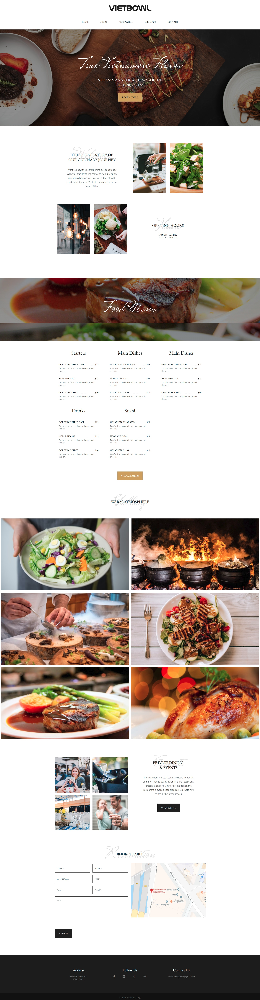

# Vietbowl Restaurant (Frontend part)

`html` `css (scss)` `javascript (jQuery)` `gulp`

by [Thaison Dang](https://github.com/thaisonbk57)

Try the [DEMO](#)

# Features

- clients can make a reservation with the form.
- excelent responsive design for all devices
